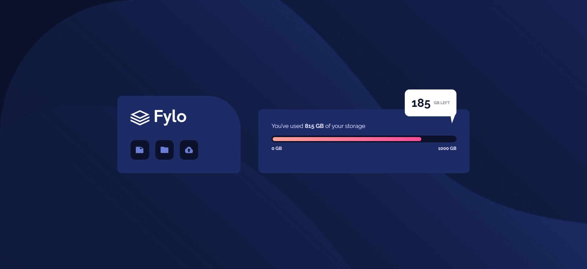

# Frontend Mentor - Fylo data storage component solution

This is a solution to the [Fylo data storage component challenge on Frontend Mentor](https://www.frontendmentor.io/challenges/fylo-data-storage-component-1dZPRbV5n). Frontend Mentor challenges help you improve your coding skills by building realistic projects. 

## Table of contents

- [Overview](#overview)
  - [The challenge](#the-challenge)
  - [Screenshot](#screenshot)
  - [Links](#links)
- [My process](#my-process)
  - [Built with](#built-with)
  - [What I learned](#what-i-learned)
- [Author](#author)


## Overview

### The challenge

Users should be able to:

- View the optimal layout for the site depending on their device's screen size

### Screenshot




### Links

- Solution URL: [Fylo Data Storage Component Solution](https://your-solution-url.com)
- Live Site URL: [Fylo Data Storage Component Live Site](https://your-live-site-url.com)

## My process

### Built with

- Semantic HTML5 markup
- CSS custom properties
- Flexbox


### What I learned

I learnt how to make a square comment icon with a div using the css below


```css
/* comment background */
.space-left {
    background-color: white; /* color of the icon */
    position: absolute; /* to position the arrow */
    right: 2rem;
    top: -3rem;
    padding: 1rem;
    border-radius: 0.7rem;
    border: none;
}

/* comment icon */
.space-left::after {
    content: "";
    width: 0;
    height: 0;
    border-left: 5px solid transparent;
    border-right: 10px solid transparent;
    border-top: 25px solid white; /* color of the comment icon */
    position: absolute; /* to position the arrow */
    bottom: -17px; /* move the arrow 5px outside of the div */
    right: 1px; /* move the arrow 5px outside of the div */
}
```


## Author

- Frontend Mentor - [@MJspitta](https://www.frontendmentor.io/profile/MJspitta)
- Twitter - [@MJspitta_](https://www.twitter.com/MJspitta_)
